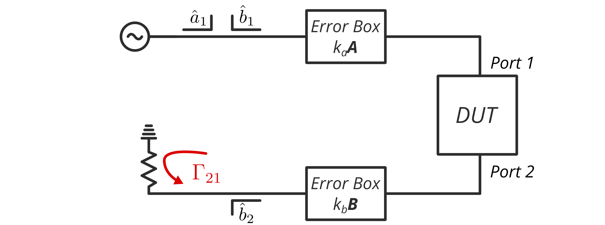
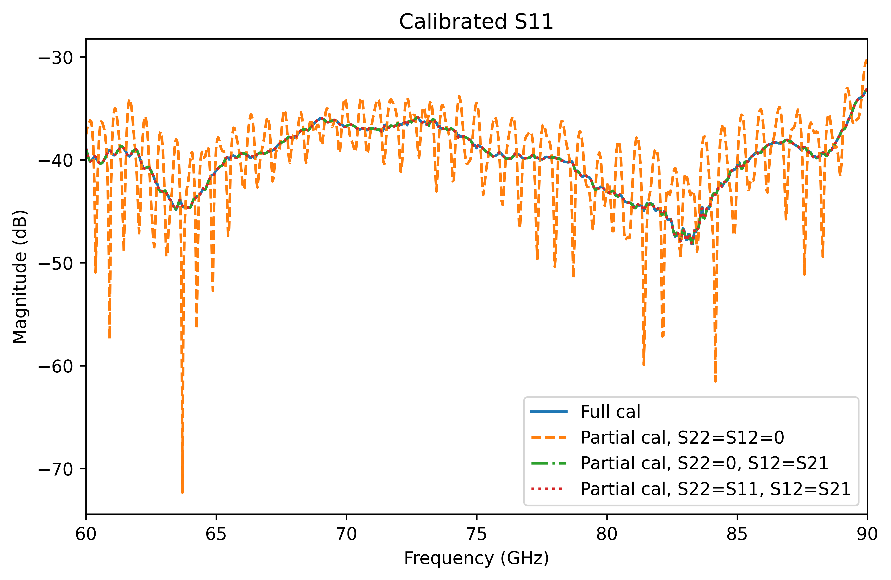
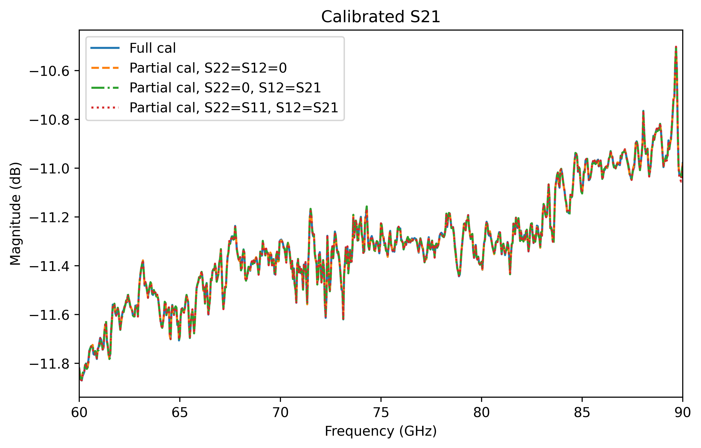

# Two-port/One-path Calibration

The purpose of this repository is to support the tutorial I wrote on two-port/one-path calibration: [https://ziadhatab.github.io/posts/two-port-one-path-calibration/](https://ziadhatab.github.io/posts/two-port-one-path-calibration/).

The general problem at hand is a VNA system that can only measure S11 and S21, and the goal is to retrieve the calibrated response of a two-port device using this system.

*Error box model of a two-port VNA with one-path source excitation.*

## Example

The example given here is not written for performance but to align with the derivation I wrote in [https://ziadhatab.github.io/posts/two-port-one-path-calibration/](https://ziadhatab.github.io/posts/two-port-one-path-calibration/). If you need something more compact, you can use the implementation in [scikit-rf](https://scikit-rf.readthedocs.io/en/latest/api/calibration/generated/skrf.calibration.calibration.TwoPortOnePath.html). The S-parameter data used here is from the [scikit-rf example](https://scikit-rf.readthedocs.io/en/latest/examples/metrology/TwoPortOnePath%2C%20EnhancedResponse%2C%20and%20FakeFlip.html).

To run the script, you need to have [`numpy`](https://numpy.org), [`matplotlib`](https://matplotlib.org), and [`scikit-rf`](https://github.com/scikit-rf/scikit-rf) installed.

Here are the results of the calibrated DUT.

 | 
:--: | :--:

